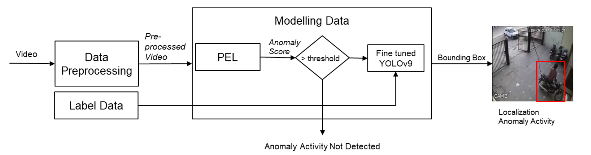
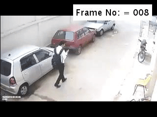
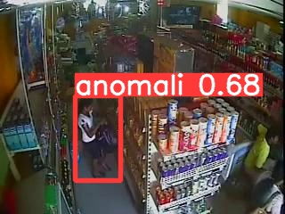
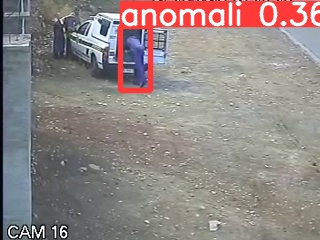

# Localization of Anomaly Activities from CCTV Surveillance Video Data in Theft Event
**Authors**: Benediktus Bryan Bimantoro, Naufal Dzaki Hafizhan, Muhammad Kevin Ardela, Rahman Indra Kesuma, Nugraha Priya Utama

A new Deep Learning method to detect and localize crime scene in video. Combining Prompt-Enhanced Learning Model ([paper link](https://arxiv.org/pdf/2306.14451.pdf)) to detect frame-level anomaly and YOLOv9 Model ([paper link](https://arxiv.org/abs/2402.13616)) to localize pixel-level anomaly in video to detect crime activity. Crime category include Stealing, Bulgary, Shoplifting, and Robbery that is trained with weakly-labeled UCF Crime Dataset with addition bounding box label for each anomaly frames.

## Abstract
Video surveillance using CCTV in public areas is essential for enhancing security and monitoring specific locations. An important task in video surveillance is detecting anomalous events, including crimes, which can vary in scale and complexity. Video anomaly detection aims to identify the occurrence of such events, while localization is crucial for precisely determining their position. This study focuses on localizing incidents of theft captured on CCTV to improve theft incident monitoring. We propose a video anomaly detection and localization approach using Prompt-Enhanced Learning (PEL) for framelevel anomaly detection and YOLOv9 for localization. PEL provides anomaly scores to filter frames with anomalous events, which then will be an input into the YOLOv9 model to generate bounding boxes for anomaly events localization in pixel level.

<div align="center">
    <a href="./">
        
    </a>
</div>

## Dataset

Please download the video files and bounding box label files before testing the model. Dataset contains UCF-Crime Test Dataset category Stealing, Bulgary, Shoplifting, and Robbery

[Test Dataset](https://drive.google.com/drive/folders/16vm4ii_ZuoVozTzvQ9oupzOkMqaxm4vR?usp=sharing)

<div align="center">
    <a href="./">
        
    </a>
</div>


Here are bounding box annotation samples. The objects inside bounding box are the location of crime activity occured
<div align="center">
    <a href="./">
        
        
    </a>
</div>

## Trained Model

The trained YOLOv9 model can be downloaded at the link below:

[YOLOv9 model trained with UCF-Crime](https://drive.google.com/drive/folders/1y3d6XbKpsUoUfgBAHSBtKw5n4M93JZp9?usp=sharing)


Images below are some previews of the model's output to localize crime activity:

<div align="center">
    <a href="./">
        
        
    </a>
</div>

## Quick Start

Please change the hyperparameters in config.py if necessary, where we keep default settings as mentioned in our paper:
```
    if dataset in ['ucf', 'ucf-crime']:
        cfg.dataset = 'ucf-crime'
        cfg.model_name = 'ucf_'
        cfg.metrics = 'AUC'
        cfg.feat_prefix = './data/pyj/feat/ucf-i3d'
        cfg.train_list = './list/ucf/train.list'
        cfg.test_list = './list/ucf/test.list'
        cfg.token_feat = './list/ucf/ucf-prompt.npy'
        cfg.gt = './list/70_15_15/ucf-gt.npy'    #adjust the path
        # TCA settings
        cfg.win_size = 9
        cfg.gamma = 0.6
        cfg.bias = 0.2
        cfg.norm = True
        # CC settings
        cfg.t_step = 9
        # training settings
        cfg.temp = 0.09
        cfg.lamda = 1
        cfg.seed = 9
        # test settings
        cfg.test_bs = 10
        cfg.smooth = 'slide'  # ['fixed': 10, slide': 7]
        cfg.kappa = 7  # smooth window
        cfg.ckpt_path = './ckpt/ucf__8636.pkl'

    # base settings
    cfg.feat_dim = 1024
    cfg.head_num = 1
    cfg.hid_dim = 128
    cfg.out_dim = 300
    cfg.lr = 5e-4
    cfg.dropout = 0.1
    cfg.train_bs = 128
    cfg.max_seqlen = 200
    cfg.max_epoch = 50
    cfg.workers = 8
    cfg.save_dir = './ckpt/'
    cfg.logs_dir = './log_info.log'

    #yolov9 settings
    cfg.anomaly_threshold = 0.5     #threshold for yolo infer anomaly frames
    cfg.weights = './ckpt/70_15_15/last.pt'    #adjust the path
    cfg.batch_size = 64
    cfg.imgsz = 256
    cfg.conf_thres = 0.001
    cfg.iou_thres = 0.7
    cfg.max_det = 300
    cfg.workers = 8
    cfg.single_cls = True
    cfg.save_json = True
    cfg.project = './runs/val'
    cfg.name = 'exp'
    cfg.exist_ok = True
    cfg.data = './datasets/frame_ucfcrime_70_15_15/test.yaml'    #adjust the path
```

Also please change the hyperparameters in configs/i3d.yaml if necessary:
```
# Model
feature_type: 'i3d'
stack_size: 16 # Feature time span in frames
step_size: 16 # Feature step size in frames
streams: 'rgb' # Streams to use for feature extraction (e.g. 'rgb' or 'flow'). Both used if left as "null" (None)
flow_type: 'raft' # Flow to use in I3D. at the moment, only 'raft' (RAFT) is supported
extraction_fps: null # For original video fps, leave as "null" (None)

# Extraction Parameters
device: 'cuda:3'  # device as in `torch`, can be 'cpu'
on_extraction: 'print'  # what to do once the features are extracted. Can be ['print', 'save_numpy', 'save_pickle']
output_path: './output' # where to store results if saved
tmp_path: './tmp' # folder to store the temporary files used for extraction (frames or aud files)
keep_tmp_files: false # to keep temp files after feature extraction.
show_pred: false # to show preds of a model, i.e. on a pre-train dataset for each feature (Kinetics 400)

# config
config: null

# Video paths
video_paths: null

#adjust the path
file_with_video_paths: './list/70_15_15/test_vid.txt' # if the list of videos is large, you might put them in a txt file, use this argument to specify the path
```
Start testing the model:
```
python main.py \
    feature_type=i3d
```

## Original Model Repository

Feature Extraction Model: [Inflated 3D](https://github.com/v-iashin/video_features)

Temporal Model: [Prompt-Enhanced Learning](https://github.com/yujiangpu20/PEL4VAD)

Spatial Model: [YOLOv9](https://github.com/wongkinyiu/yolov9)

## Acknowledgements

- Model trained at AI facility Tambora Server Institut Teknologi Bandung Indonesia
