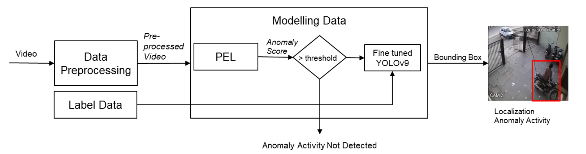
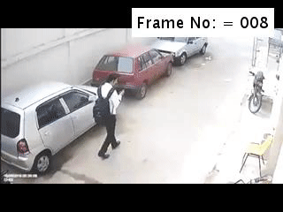

# Crime Video Localization
**Authors**: Benediktus Bryan Bimantoro, Naufal Dzaki Hafizhan, Muhammad Kevin Ardela

A new Deep Learning method to detect and localize crime scene in video. Combining Prompt-Enhanced Learning Model to detect frame-level anomaly and YOLOv9 Model to localize pixel-level anomaly in video to detect crime activity. Crime category include Stealing, Bulgary, Shoplifting, and Robbery that is trained with weakly-labeled UCF Crime Dataset with addition bounding box label for each anomaly frames.

<div align="center">
    <a href="./">
        
    </a>
</div>

## Dataset

<div align="left">
    <a href="./">
        
    </a>
</div>
[Test Dataset](https://drive.google.com/drive/folders/13RrxLeV-nwSe6gIq4YcchsH82dPoKMjz?usp=sharing) UCF-Crime Test Dataset category Stealing, Bulgary, Shoplifting, and Robbery

## Quick Start

```
python main.py \
    feature_type=i3d
```

## Original Model

Feature Extraction Model: [Inflated 3D](https://github.com/v-iashin/video_features)

Temporal Model: [Prompt-Enhanced Learning](https://github.com/yujiangpu20/PEL4VAD)

Spatial Model: [YOLOv9](https://github.com/wongkinyiu/yolov9)

## Acknowledgements

- Tambora Server Institut Teknologi Bandung
